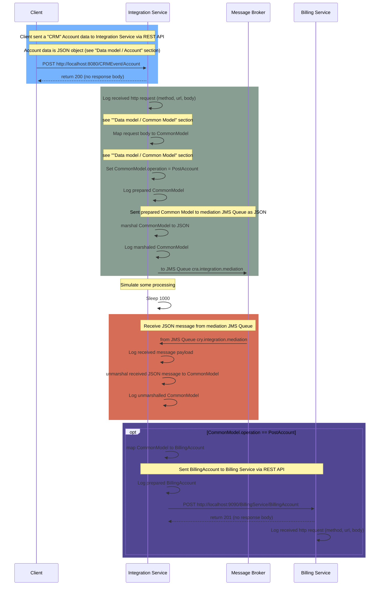

# CRA Interview Task - Do some integration

Target is create a simple Integration application.

## TODO
- Create public **GitHub** repository named: **Do Some Integration**
  - Repo should contains multi module **Maven** project
    - first module: **IntegrationService**
    - second module: **BillingService**
    <br><br>
- Create application **IntegrationService** according to sequence diagram
  - Use [Apache Camel on Spring Boot](https://camel.apache.org/camel-spring-boot/next/spring-boot.html)
    - **Please, do not use Spring Boot controllers for REST API!**
    - Camel aspects e.g. context, routes, etc. have to be implemented using [**Spring DSL**](https://camel.apache.org/manual/spring-xml-extensions.html)
    - For other functionality (mapper, utils, etc.) you can use classic Java
    <br><br>
- Create application **BillingService** according to sequence diagram
  - Use [Apache Camel on Spring Boot](https://camel.apache.org/camel-spring-boot/next/spring-boot.html)
    - **Please, do not use Spring Boot controllers for REST API!**
    - Camel aspects e.g. context, routes, etc. have to be implemented using [**Spring DSL**](https://camel.apache.org/manual/spring-xml-extensions.html)
    - For other functionality (mapper, utils, etc.) you can use classic Java
    <br><br>
- Some examples:
  - https://www.baeldung.com/spring-apache-camel-tutorial
  - https://examples.javacodegeeks.com/enterprise-java/apache-camel/apache-camel-spring-example/
  - https://github.com/apache/camel-spring-boot-examples



## Data Model
### Account
#### Class
```java
@Data
public class Account extends IntegrationApiModel {
	
	private Long id;
	
	private String firstname;
	
	private String lastname;
	
	@JsonFormat(pattern="yyyy-MM-dd HH:mm:ss")
	private Date updatedAt;

}
```
#### JSON
```json
{
  "id": 12345,
  "firstname": "John",
  "lastname": "Doe",
  "updatedAt": "2023-02-14 10:38:00"
}
```

### CommonModel
#### Class
```java
@Data
public class CommonModel {
	
	private String operation;
	
	private IntegrationApiModel apiModel;

}
```

### BillingAccount
#### Class
```java
@Data
public class BillingAccount {
	
	private Long id;
	
	private String name; /* firstname + lastname */
		
	@JsonFormat(pattern="yyyy-MM-dd")	
	private Date lastUpdate;
		
}
```
#### JSON
```json
{
  "id": 12345,
  "name": "John Doe",
  "lastUpdate": "2023-02-14"
}
```